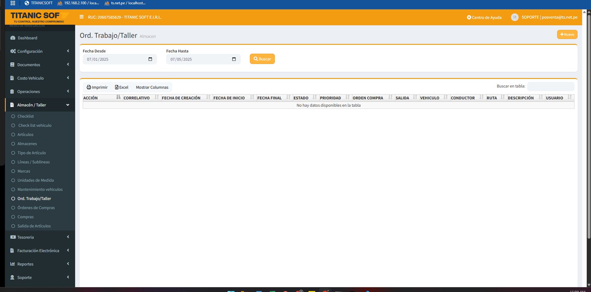

# ALMACÉN

## 🏢 ALMACEN

Un **almacén** es un espacio físico donde se almacenan los **repuestos y demás artículos** utilizados por la empresa.

<figure><figcaption></figcaption></figure>

***

**🆕 Registrar un nuevo almacén**

1. Presiona el botón **"Nuevo"**.

<figure><figcaption></figcaption></figure>

1.  Completa los siguientes campos:

    * 🏷️ **Nombre del almacén** _(obligatorio)_
    * 🗒️ **Observación** _(opcional)_

    <figure><figcaption></figcaption></figure>
2. Haz clic en **"Guardar"**.

***

Una vez guardado, el nuevo almacén aparecerá en la lista de almacenes registrados.
