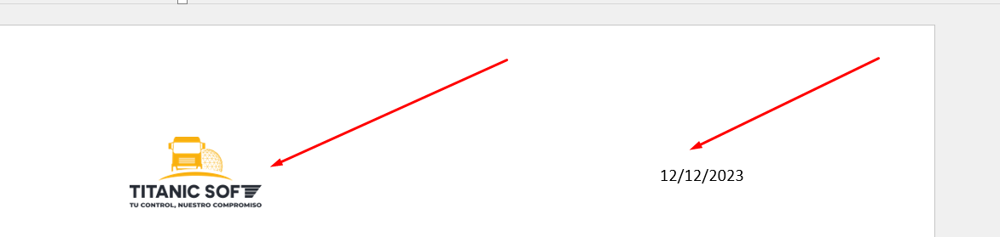

# ¿Cómo estructurar un ticket ?

### ¿Qué es un ticket de atención?

Un "ticket de atención" es un registro numerado que documenta las solicitudes y problemas de los clientes para facilitar su seguimiento y resolución en la atención al cliente y el soporte técnico.

**Añado un video.**



Para realizar un ticket es de la siguiente manera.

1. En primer lugar abrir un documento Word y colocar el logo de su empresa y la fecha de creación

<figure><figcaption></figcaption></figure>

2. Enumerar y describir los cambios que necesitas, además adjuntar una captura de pantalla. Como se muestra el ejemplo

<figure><figcaption></figcaption></figure>

Después de terminar de crear su documento subir el ticket a la plataforma de soporte.

## ¿Como subir el ticket?

1. Ingresar al sistema de soporte: [https://soporte.ts.nom.pe/](https://soporte.ts.nom.pe/), con sus credenciales, si no tuvieses solicitar al grupo de WhatsApp.

<figure><figcaption></figcaption></figure>

2. Presionar en el botón de crear ticket. y llenas el formulario

<figure><figcaption></figcaption></figure>

2. Finalmente, en la sección mis ticket aparecerán todos los ticket y sus respectivos estados

Espero que esté artículo te hay ayudado, quedamos atentos a cualquier consulta adicional.
